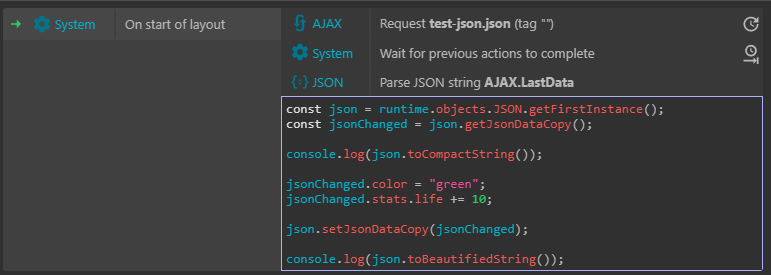

<script>
import { base } from '$app/paths';
console.log(window.location.href);
const isSvelte = (window.location.href.substring(window.location.href.length - 9)) !== "readme.md";
</script>


{#if !isSvelte} 
# How to use JSON in JavaScript

* **c3p** [how-to-use-json-in-javascript-20.05.26.c3p](source/c3p/how-to-use-json-in-javascript-20.05.26.c3p)
* **demo** [link](demo)
* **Patreon** [link](https://patreon.com/el3um4s)
  
{/if}


### global_runtime.js

```javascript
runOnStartup(async  runtime =>  {  globalThis.g_runtime  =  runtime })
```

### json_helper.js

```javascript
let json = null;
let jsonObj = null;

function json_initialize(json_name) {
	json = g_runtime.objects[json_name].getFirstInstance();
	jsonObj = json.getJsonDataCopy();
}

function json_getKey(json_key){
	const result = jsonObj[json_key];
	return JSON.stringify(result);
}

function json_changeKey(key, value) {
	jsonObj[key] = value
	json.setJsonDataCopy(jsonObj);
}
```

### Event Sheet


