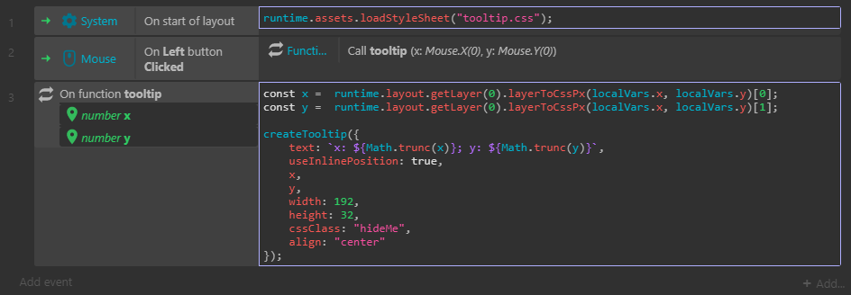

# How to create tooltips

* **c3p** [004-how-to-create-tooltips-20.06.26.c3p](source/c3p/004-how-to-create-tooltips-20.06.26.c3p)
* **demo** [link](demo)
* **Patreon** [link](https://patreon.com/el3um4s)

### c3_tooltips_helper.js

```javascript
class Tooltip extends HTMLElement {

	constructor() {
		super();
		this._tooltipContainer;
		this._X = 0;
		this._Y = 0;
		this._randomID = 0;
		this.attachShadow({mode: `open`});
		this.shadowRoot.innerHTML = `
			<style>
				:host {
					animation: cssAnimation 1.5s forwards;
					position: absolute;
					background-color: #f5f5f5;
					color: #252A34;
					padding: 4px;
					border-radius: 4px;
					text-align: center;
					min-width: 192px;
					max-width: 192px;
					max-height: 32px;
					user-select: none;
					font-family: "Monotalic";
				}
				
				@keyframes cssAnimation {
					0%   {opacity: 0; width:0px; height:0px;}
					40%  {opacity: 0.9; width:192px; height:32px;}
					60%  {opacity: 0.9; width:192px; height:32px;}
					100% {opacity: 0; width:0px; height:0px;}
				}
			</style>
			<slot>Mouse Position</slot>
		`;
	}
	
	connectedCallback() {

		this._randomID = this.getAttribute(`id`);
		this._showTooltip();
		setTimeout(() => { this._deleteTooltip()}, 1500)
	}
	
	_showTooltip() {
		this._tooltipContainer = document.createElement('div');
		this.shadowRoot.appendChild(this._tooltipContainer);
	}
	
	_deleteTooltip() {
		document.getElementById(this._randomID).remove();
	}
}

customElements.define(`deto-tooltip`, Tooltip);
```

### Event Sheet



