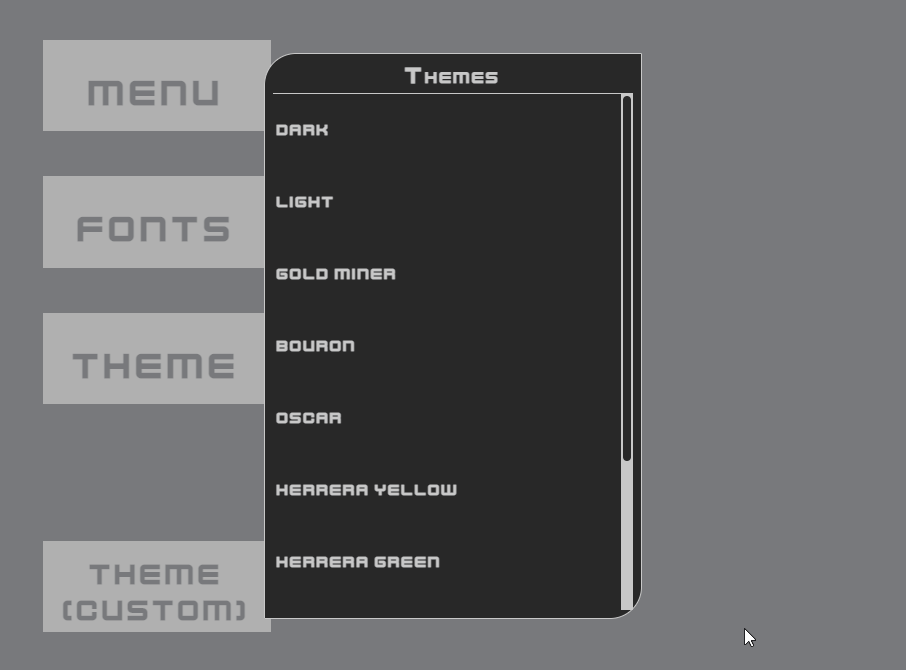
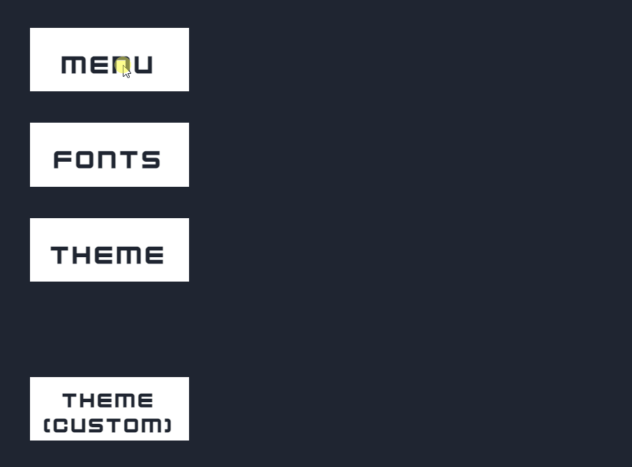
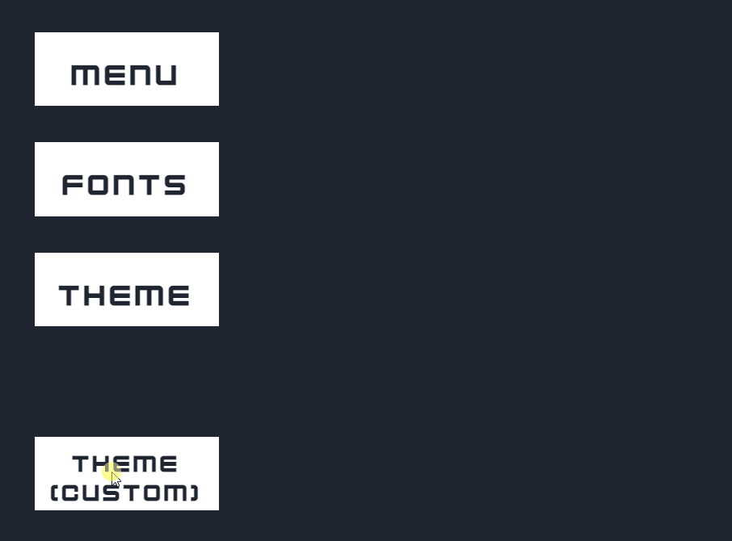

# Menu

* **c3p** [menu.c3p](source/c3p/menu.c3p)
* **demo** [link](demo)
* **Patreon** [link](https://www.patreon.com/posts/how-to-create-in-52709981)
* **menu.js** [link](source/lib-menu/menu.js)
* **menu.css** [link](source/lib-menu/menu.css)
 

